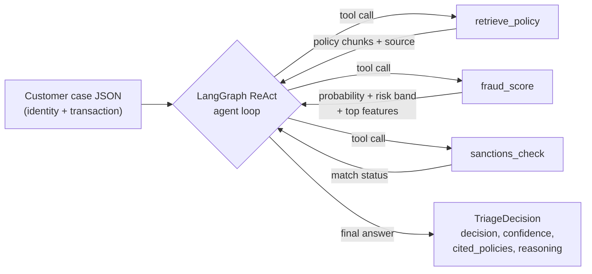

# KYC Fraud Triage Agent

[](https://github.com/Al-Tehrani/kyc-fraud-triage-agent/actions/workflows/ci.yml)

## What it does

An agentic AI system for identity verification and fraud prevention, modeled
on real KYC/AML compliance workflows. Given a customer case — identity
attributes plus transaction context — a LangGraph agent gathers evidence
through tools (policy retrieval, fraud scoring, sanctions screening) and
returns a structured, auditable triage decision:

- **decision**: `approve`, `review`, or `escalate`
- **confidence**: how clear-cut the case is, not a flat constant
- **cited_policies**: the specific policy documents backing the call
- **reasoning**: a plain-language explanation a compliance analyst could follow and check

Nothing here is a black box: every decision traces back to a fraud
probability, a sanctions match status, and the policy passages retrieved to
justify it.

## Live demo

**[kyc-fraud-triage-agent.onrender.com/docs](https://kyc-fraud-triage-agent.onrender.com/docs)**

Interactive Swagger UI — try `POST /triage` directly in the browser. This
runs on Render's free tier, which spins the instance down when idle, so
**the first request after a period of inactivity can take ~50 seconds** to
wake up. Subsequent requests are fast.

```
curl https://kyc-fraud-triage-agent.onrender.com/health
```

`POST /triage` expects 28 anonymized transaction features (`v1`..`v28`) plus
`amount` — see `/docs` for the full schema and a fillable example.

## How it works

### The agent loop

A [LangGraph](https://github.com/langchain-ai/langgraph) state graph runs a
ReAct-style loop: the model reasons about what evidence it still needs,
calls a tool, observes the result, and repeats until it has enough to
decide. By default this runs on a deterministic **stub model**
(`src/agent/stub_model.py`) that executes a fixed evidence-gathering
sequence and applies the documented decision rule — no LLM API key
required, and the same behavior every run. A live LLM is a drop-in swap
behind the same `ChatModel` interface (see [Limitations](#limitations-and-next-steps)).

### Tools

- **`retrieve_policy(query)`** — searches the KYC/AML policy documents in
  `data/policies/` and returns the top-k matching chunks with their source
  document, so every decision can cite the policy that justifies it.
- **`fraud_score(transaction)`** — scores the transaction with a trained
  XGBoost classifier, returning a fraud probability, a risk band
  (`low` / `gray_zone` / `high` per `risk_score_thresholds.md`), and the
  top contributing features by SHAP value.
- **`sanctions_check(name, dob)`** — screens the applicant against a
  synthetic sanctions/PEP watchlist, returning `confirmed_match`,
  `candidate_false_positive` (name matches, DOB doesn't — routed to review,
  never auto-cleared), or `no_hit`.

### Decision rule

A confirmed sanctions match always escalates. Otherwise, the fraud
probability against the policy thresholds decides: below 0.30 → approve,
0.30–0.70 → review, above 0.70 → escalate. A sanctions candidate false
positive forces at least a review even when the transaction itself is
low-risk, per `sanctions_screening.md`.

### Memory

A simple in-process case memory, keyed by `entity_id`, carries a repeat
entity's prior decision, fraud probability, and sanctions status into its
next case.

## Architecture



## Tech stack

- **Agent orchestration:** LangGraph, LangChain
- **Fraud model:** XGBoost, scikit-learn, pandas
- **Policy retrieval:** scikit-learn `TfidfVectorizer` (see [Limitations](#limitations-and-next-steps) for why not neural embeddings)
- **API:** FastAPI, uvicorn, Pydantic
- **Testing:** pytest, httpx
- **Deployment:** Docker, GitHub Actions CI, Render

## Fraud model metrics

The XGBoost classifier trains on a synthetic stand-in for Kaggle's
["Credit Card Fraud Detection"](https://www.kaggle.com/mlg-ulb/creditcardfraud)
dataset (`src/ml/data.py`) — 28 anonymized PCA-style features plus
transaction amount, matching that dataset's schema exactly, so dropping the
real `creditcard.csv` in at `data/creditcard.csv` retrains on real data with
no code changes. On a held-out synthetic split:

| Metric | Value |
| --- | --- |
| ROC AUC | 0.998 |
| Precision | 1.00 |
| Recall | 0.70 |

These numbers reflect how separable the *synthetic* generator's fraud/legit
distributions are, not real-world fraud detection performance — see
[Limitations](#limitations-and-next-steps).

## Running locally

### Docker

```
docker build -t kyc-fraud-triage-agent .
docker run -p 8000:8000 kyc-fraud-triage-agent
```

Then visit `http://localhost:8000/docs`.

### Python venv

```
python -m venv .venv
source .venv/bin/activate
pip install -r requirements.txt

uvicorn src.api.app:app --reload
pytest -q
```

## Why explainability matters for KYC/AML

A triage agent that can't show its work is a liability in a regulated
compliance context — a compliance analyst (or a regulator, after the fact)
has to be able to reconstruct *why* a case was approved, reviewed, or
escalated. This project's decision output is designed around that
constraint, not bolted on afterward:

- Every decision cites the specific policy passages (`cited_policies`) that
  back it, retrieved by `retrieve_policy` rather than asserted.
- `fraud_score` doesn't just return a probability — it returns the top
  contributing features by **SHAP value** (XGBoost's `pred_contribs`), so
  an analyst reviewing an escalate or review decision can see exactly which
  anonymized transaction features pushed the score, and by how much.
- `confidence` scales with how clear-cut the case is (distance from the
  decision threshold, or a hard rule like a confirmed sanctions match)
  rather than being a flat, uninformative constant.
- `reasoning` is a plain-language explanation citing the actual fraud
  probability and sanctions result, not a templated string.

This mirrors how identity verification and fraud decisions have to work in
practice: a model that flags a transaction is only useful if a human can
audit *why*, especially when the outcome is an account restriction or a
regulatory filing.

## Limitations and next steps

- **Synthetic data throughout.** The fraud model trains on a synthetic
  generator mimicking the real Kaggle dataset's shape (not the real thing),
  and the sanctions/PEP watchlist is a small fabricated list. Metrics and
  policy citations here demonstrate the pipeline, not production-grade
  fraud detection.
- **Stub model by default.** The agent runs on a deterministic stub, not a
  live LLM, so the demo needs no API key and every run is reproducible.
  Live mode is gated behind the `TRIAGE_LIVE` env var and designed as a
  drop-in seam (`src/agent/model.py`) behind the same `ChatModel`
  interface the stub implements — wiring in a real LangChain chat model
  bound to the same tools is the natural next step, with no changes needed
  to the graph, tools, or decision logic.
- **TF-IDF instead of neural embeddings for retrieval.** `retrieve_policy`
  originally used sentence-transformers + FAISS; that stack was replaced
  with a scikit-learn TF-IDF vectorizer to fit Render's free-tier 512MB
  memory budget, since a neural embedding model was the single biggest RAM
  consumer for what's a five-document policy corpus. It's a reasonable
  trade for a corpus this small and keyword-heavy, but wouldn't scale to a
  larger, more semantically varied policy library without reconsidering.
- **Free-tier cold start.** The Render deployment sleeps when idle; the
  first request after a while can take ~50 seconds. A paid tier or a
  scheduled keep-alive ping would fix this in production.
- **In-process case memory.** Memory doesn't persist across restarts —
  fine for a demo, not for production, where it'd need a real datastore.

## Owner

Ali (AL Tehrani), ML engineer. MMath Data Science (Waterloo), thesis on
Interpretable ML. See [CLAUDE.md](CLAUDE.md) for architecture, stack, and
build history in more detail.
